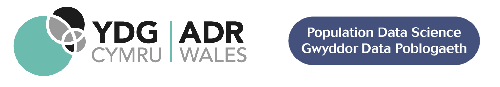

  

# Clinical coding and capture of Long COVID: a cohort study in Wales using linked health and demographic data
### Hoda Abbasizanjani 1, Stuart Bedston 1, Lucy Robinson 2, Matthew Curds 2, Ashley Akbari 1

1 Population Data Science, Swansea University Medical School, Faculty of Medicine, Health & Life Science, Swansea University  
2 Welsh Government  

## 📝 Project description

This study investigates clinical coding of Long COVID recorded in primary and secondary care for the population of Wales to aid in understanding the coding quality, variation of use in primary care software systems, completeness and useability of data.
Furthermore, this study provides a comprehensive characterisation of patients clinically diagnosed with Long COVID, aiming to build a deeper understanding of this relatively new condition.

## 🖋 How to cite this work

> Abbasizanjani H, Bedston S, Robinson L, Curds M, Akbari A. Clinical coding and capture of Long COVID: a cohort study in Wales using linked health and demographic data. ADR Wales Data Insight. August 2023.
https://adrwales.org/wp-content/uploads/2023/08/Clinical-coding-and-capture-of-Long-COVID.pdf

## 📃 Funding

This research has been carried out as part of the ADR Wales programme of work, as part of the Major Societal Challenges thematic research area. The thematic research areas align with the priority themes identified in the Welsh Government’s Programme for Government. ADR Wales brings together data science experts at Swansea University Medical School, staff from the Wales Institute of Social and Economic Research and Data (WISERD) at Cardiff University and specialist teams within the Welsh Government. It develops new evidence which supports the Programme for Government by using the SAIL Databank at Swansea University to link and analyse anonymised data. ADR Wales is part of ADR UK, which is funded by the Economic and Social Research Council (part of UK Research and Innovation).

## ❤ Acknowledgements

We wish to acknowledge the collaborative partnership that enabled the acquisition and access to the de-identified data, which led to this output. The collaboration was led by the Swansea University Population Data Science group, under the direction of the Welsh Government Technical Advisory Cell (TAC) and includes the following groups and organisations: the Secure Anonymised Information Linkage (SAIL) Databank, Health Data Research UK (HDR UK), Administrative Data Research (ADR) Wales, Digital Health and Care Wales (DHCW formerly NHS Wales Informatics Service (NWIS)), Public Health Wales, NHS Shared Services and the Welsh Ambulance Service Trust (WAST). All research has been completed under the permission and approval of the SAIL independent Information Governance Review Panel (IGRP) project number 0911.

This work uses data provided by patients and collected by the NHS as part of their care and support. We would also like to acknowledge all data providers who make anonymised data available for research.

## 🤝 Project approval

All research has been completed under the permission and approval of the SAIL independent Information Governance Review Panel (IGRP) project number 0911. Further details of this process can be found on the SAIL Databank website (https://saildatabank.com/)

## ♻️ License

Shield: [![CC BY 4.0][cc-by-shield]][cc-by]

This work is licensed under a
[Creative Commons Attribution 4.0 International License][cc-by].

[![CC BY 4.0][cc-by-image]][cc-by]

[cc-by]: http://creativecommons.org/licenses/by/4.0/
[cc-by-image]: https://i.creativecommons.org/l/by/4.0/88x31.png
[cc-by-shield]: https://img.shields.io/badge/License-CC%20BY%204.0-lightgrey.svg
